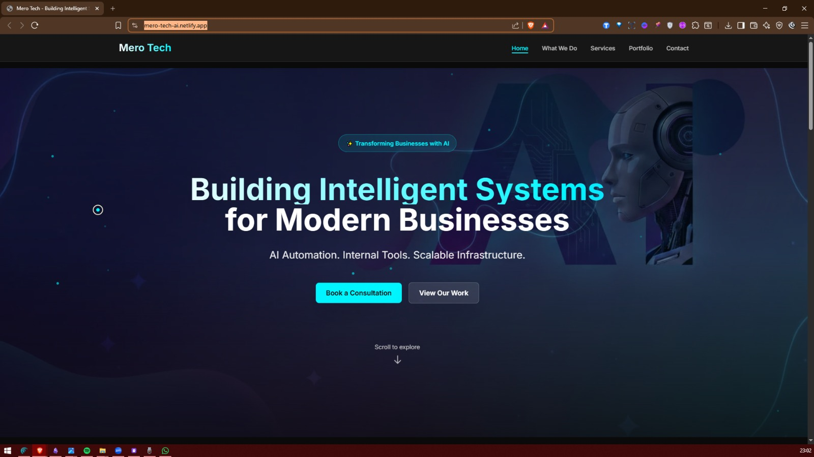

# Mero Tech - AI & Software Solutions Website

<div align="center">
  
</div>

<br />

A premium, highly interactive marketing website showcasing AI automation, internal tools, and cloud infrastructure services. Built with modern web technologies and featuring stunning animations, this site demonstrates technical excellence through its implementation.

## 🎯 Purpose

This website serves as the digital presence for Mero Tech, a technology consultancy specializing in:
- **AI Automation & Workflows** - Intelligent systems that streamline business operations
- **Internal Business Tools** - Custom software solutions for team productivity
- **Web Applications** - Scalable, modern web platforms
- **Cloud Infrastructure** - Reliable AWS/cloud solutions and DevOps engineering
- **AI Consulting** - Strategic guidance for AI adoption

The site features a portfolio of projects, service offerings, and a contact form for consultation bookings.

## ✨ Key Features

- **Interactive Animations** - Custom cursor, parallax effects, 3D card tilts, floating particles, and smooth transitions
- **Performance Optimized** - Bundle size optimization, image optimization (WebP/AVIF), lazy loading, and dynamic imports
- **Fully Responsive** - Mobile-first design with comprehensive responsive layouts
- **SEO Ready** - Open Graph metadata, structured data, sitemap, and robots.txt
- **Type-Safe** - Full TypeScript implementation with strict type checking
- **Tested** - Unit tests, integration tests, and property-based tests (235+ tests)
- **Accessible** - WCAG considerations and keyboard navigation support

## 🛠️ Tech Stack

### Core
- **Framework**: Next.js 14 (App Router) - React framework with server-side rendering
- **Language**: TypeScript - Type-safe JavaScript
- **Styling**: TailwindCSS - Utility-first CSS framework
- **Animation**: Framer Motion - Production-ready motion library

### Features & Tools
- **Form Validation**: Zod - TypeScript-first schema validation
- **Security**: DOMPurify - XSS sanitization for user inputs
- **Testing**: Jest + React Testing Library + Fast-check (property-based testing)
- **Performance**: Next.js Bundle Analyzer, Lighthouse CI
- **Deployment**: Netlify-ready with optimized configuration

### Development
- **Linting**: ESLint with Next.js config
- **Code Quality**: Prettier for formatting
- **Type Checking**: Strict TypeScript configuration

## 🚀 Getting Started

### Prerequisites
- Node.js 20.x or higher
- npm or yarn

### Installation

1. Clone the repository:
```bash
git clone https://github.com/98Devops/mero.git
cd mero
```

2. Install dependencies:
```bash
npm install
```

3. Run the development server:
```bash
npm run dev
```

4. Open [http://localhost:3000](http://localhost:3000) in your browser

### Build for Production

```bash
npm run build
npm run start
```

## 📁 Project Structure

```
mero-tech-website/
├── app/                      # Next.js App Router
│   ├── api/                  # API routes (contact form)
│   ├── contact/              # Contact page
│   ├── portfolio/            # Portfolio page
│   ├── services/             # Services page
│   ├── what-we-do/           # What We Do page
│   ├── layout.tsx            # Root layout with metadata
│   ├── page.tsx              # Home page
│   ├── error.tsx             # Error boundary
│   └── loading.tsx           # Loading states
├── components/
│   ├── ui/                   # Reusable UI components
│   │   ├── Button.tsx
│   │   ├── GlassCard.tsx
│   │   ├── CustomCursor.tsx
│   │   └── ScrollProgress.tsx
│   ├── sections/             # Page sections
│   │   ├── HeroSection.tsx
│   │   ├── ServicesGrid.tsx
│   │   ├── PortfolioGrid.tsx
│   │   └── ServiceCard.tsx
│   ├── forms/                # Form components
│   │   └── ContactForm.tsx
│   └── navigation/           # Navigation components
│       ├── Header.tsx
│       └── MobileMenu.tsx
├── lib/                      # Utilities and constants
│   ├── constants.ts          # Services and projects data
│   ├── validation.ts         # Zod schemas
│   └── utils.ts              # Helper functions
├── styles/                   # Animation variants
│   └── animations.ts
├── public/                   # Static assets
│   └── images/
│       ├── hero-background.png
│       └── portfolio/
└── __tests__/                # Test files
```

## Development

- `npm run dev` - Start development server
- `npm run build` - Build for production
- `npm run start` - Start production server
- `npm run lint` - Run ESLint

## Performance Targets

- Lighthouse Score: 90+
- Load Time: < 2 seconds
- Bundle Size: < 200KB (gzipped)
